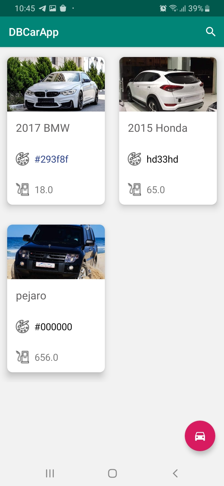
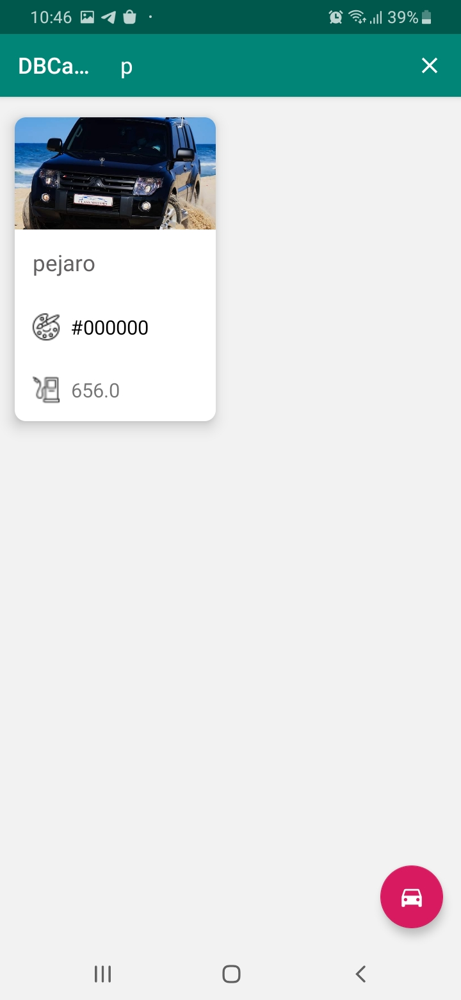
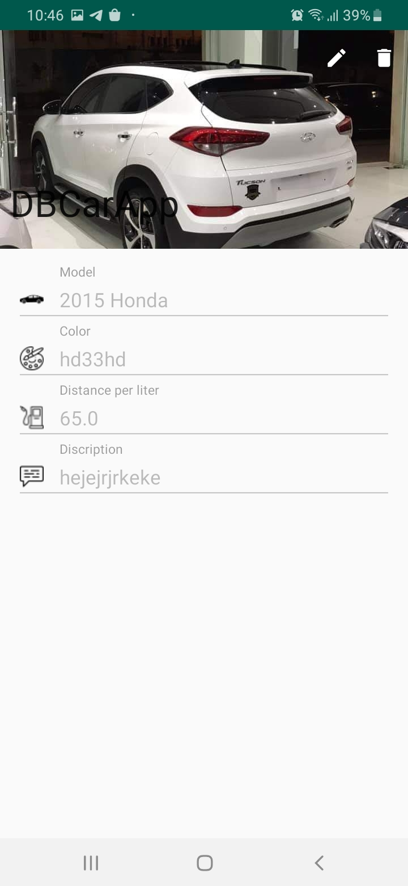
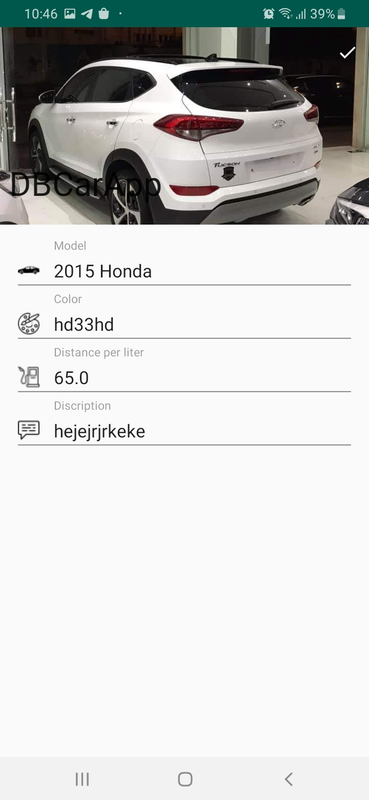

# DBCarApp
 The idea of this application is based on the user's ability to store car data such as the car’s image, model, distance per liter and a general description about it, and all this data is stored in a local data base inside the application, with the ability to search for a specific car from the search bar as well as the user can modify the car’s complete data.

Some Screenshots:

